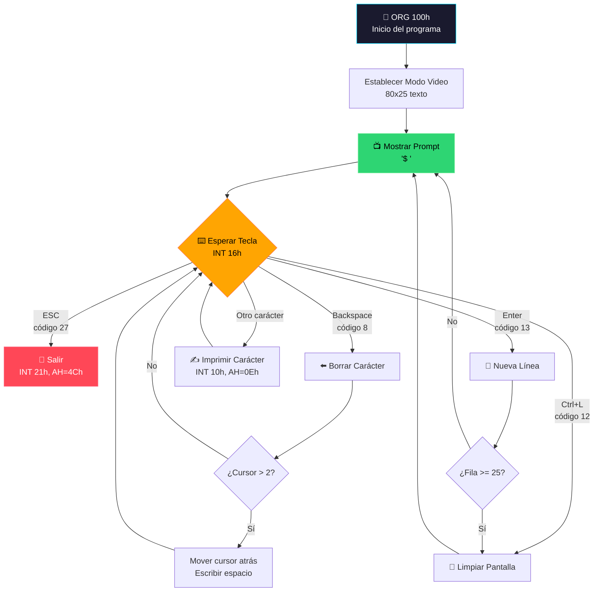
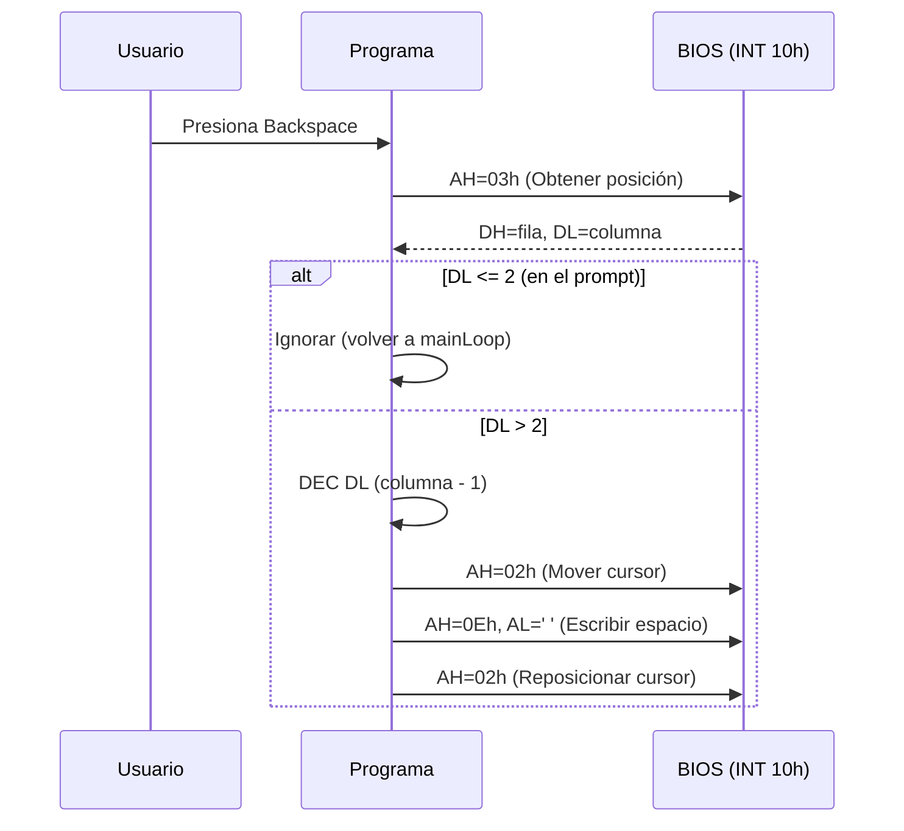

<div align="center">

# 🐚 Bash Shell — x86 Assembly

[](https://en.wikipedia.org/wiki/X86_assembly_language)
[](https://nasm.us/)
[](https://www.dosbox.com/)
[](LICENSE)

**Un shell interactivo completo escrito en ensamblador puro x86 de 16 bits**

*Experimenta la programación a nivel de hardware: sin sistema operativo moderno, sin abstracciones, solo tú y la BIOS.*

[Características](#-características) •
[Quick Start](#-quick-start) •
[Arquitectura](#-arquitectura-técnica) •
[Documentación](#-documentación-de-interrupciones)

</div>

---

## 🎯 El Problema que Resuelve

Los entornos modernos de programación abstraen **completamente** la interacción con el hardware. Este proyecto elimina esas capas de abstracción para demostrar cómo funciona una terminal a nivel de **interrupciones de BIOS**, proporcionando:

- 📚 **Valor Educativo**: Comprensión profunda de cómo el teclado, la pantalla y el CPU colaboran en tiempo real
- ⚡ **Eficiencia Extrema**: Solo **~100 bytes** de ejecutable final (modelo de memoria `tiny`)
- 🔧 **Control Total**: Manipulación directa de registros, memoria de video y rutinas del sistema

---

## ✨ Características

| Característica | Descripción | Tecla |
|:---|:---|:---:|
| **Prompt Interactivo** | Indicador visual `$ ` que señala disponibilidad de entrada | — |
| **Captura en Tiempo Real** | Cada pulsación se procesa y renderiza instantáneamente | `A-Z`, `0-9` |
| **Backspace Inteligente** | Borrado con protección del prompt (no sobrescribe `$ `) | `⌫` |
| **Nueva Línea** | Avance de cursor con reposicionamiento automático | `↵ Enter` |
| **Screen Clear** | Limpieza instantánea de la terminal | `Ctrl+L` |
| **Auto-Scroll** | Al alcanzar la fila 25, limpia y reinicia desde arriba | Automático |
| **Salida Segura** | Termina el proceso y devuelve control a DOS | `ESC` |

---

## � Quick Start

### Prerrequisitos

| Herramienta | Propósito | Instalación |
|:---|:---|:---|
| **NASM** | Ensamblador | `sudo apt install nasm` / `choco install nasm` |
| **DOSBox** | Emulador DOS | `sudo apt install dosbox` / `choco install dosbox` |

### Compilación y Ejecución

```bash
# 1. Clonar el repositorio
git clone https://github.com/<tu-usuario>/Bash_ensamblador.git
cd Bash_ensamblador

# 2. Compilar (genera Practica.com)
nasm -f bin Practica.asm -o Practica.com

# 3. Ejecutar con script automático (Linux/macOS)
./build.sh
```

<details>
<summary><b>🖥️ Ejecución Manual en DOSBox</b></summary>

```dosbox
# Dentro de DOSBox:
mount c /ruta/al/proyecto
c:
Practica.com
```

</details>

> [!NOTE]
> El flag `-f bin` genera un binario **plano** sin cabeceras PE/ELF. Esto es esencial para archivos `.com` que cargan directamente en `CS:0100h`.

---

## 🏗️ Arquitectura Técnica

El shell opera en **modo real x86** (16 bits), comunicándose directamente con la BIOS mediante interrupciones de software.

### Flujo de Ejecución Principal



### Mapa de Memoria del Programa

```
┌─────────────────────────────────────────────────┐
│  0000:0100h   ← ORG 100h (inicio .COM)          │
├─────────────────────────────────────────────────┤
│  Código ejecutable (~85 líneas ASM)             │
│    ├── start:        Inicialización de video   │
│    ├── printPrompt:  Renderizado del prompt    │
│    ├── mainLoop:     Bucle principal de input  │
│    ├── backspace:    Lógica de borrado         │
│    ├── newLine:      Gestión de cursor         │
│    ├── clear:        Reset de pantalla         │
│    └── exit:         Terminación del proceso   │
├─────────────────────────────────────────────────┤
│  Stack                                          │
│  (Crece hacia direcciones bajas)                │
└─────────────────────────────────────────────────┘
```

---

## 📖 Documentación de Interrupciones

<details>
<summary><b>INT 10h — Servicios de Video BIOS</b></summary>

| AH | Función | Uso en el Proyecto |
|:---:|:---|:---|
| `00h` | Establecer modo de video | Modo 03h (texto 80x25, 16 colores) |
| `02h` | Posicionar cursor | Mover cursor tras backspace |
| `03h` | Obtener posición del cursor | Leer DH (fila) y DL (columna) |
| `0Eh` | Teletype output | Imprimir caracteres con avance automático |

**Ejemplo: Escribir un carácter**
```asm
MOV AH, 0Eh    ; Función teletype
MOV AL, 'A'    ; Carácter a imprimir
INT 10h        ; Llama a BIOS
```

</details>

<details>
<summary><b>INT 16h — Servicios de Teclado BIOS</b></summary>

| AH | Función | Descripción |
|:---:|:---|:---|
| `00h` | Leer tecla | Bloquea hasta recibir entrada. AL = ASCII, AH = Scan code |

**Ejemplo: Leer una tecla**
```asm
MOV AH, 00h    ; Esperar tecla
INT 16h        ; AL contiene el código ASCII
CMP AL, 27     ; ¿Es ESC?
JE exit        ; Salir si es ESC
```

</details>

<details>
<summary><b>INT 21h — Servicios de DOS</b></summary>

| AH | Función | Descripción |
|:---:|:---|:---|
| `4Ch` | Terminar programa | Devuelve control al DOS con código de salida en AL |

</details>

---

## 🔬 Análisis del Algoritmo de Backspace

El manejo de la tecla *Backspace* es el fragmento más sofisticado del código, requiriendo:

1. **Lectura de posición actual** del cursor
2. **Validación de límites** (no borrar el prompt)
3. **Movimiento hacia atrás** del cursor
4. **Sobrescritura** con espacio en blanco
5. **Reposicionamiento** final del cursor



> [!IMPORTANT]
> La constante `2` en `CMP DL, 2` corresponde a los dos caracteres del prompt (`$` y espacio). Modificar el prompt requiere ajustar este valor.

---

## 📂 Estructura del Proyecto

```
Bash_ensamblador/
├── 📄 Practica.asm    # Código fuente en ensamblador x86
├── 📦 Practica.com    # Binario ejecutable (generado)
├── 🔧 build.sh        # Script de compilación + ejecución
└── 📖 README.md       # Este documento
```

---

## � Tech Stack

| Categoría | Tecnología |
|:---|:---|
| **Lenguaje** | x86 Assembly (16-bit Real Mode) |
| **Ensamblador** | NASM (Netwide Assembler) |
| **Formato de salida** | COM (Flat Binary, offset 100h) |
| **Entorno de ejecución** | DOSBox / MS-DOS / FreeDOS |
| **Interrupciones** | BIOS (INT 10h, 16h) + DOS (INT 21h) |

---

## 🛣️ Roadmap (Ideas Futuras)

- [ ] 🎨 **Soporte de colores ANSI** mediante atributos de video
- [ ] 📜 **Historial de comandos** con buffer circular
- [ ] 📁 **Comandos básicos**: `dir`, `cls`, `echo`
- [ ] 🔤 **Prompt personalizable** desde variable de entorno

---

## 🤝 Contribuciones

¡Las contribuciones son bienvenidas! Sigue el flujo estándar:

```bash
# 1. Fork del repositorio
# 2. Crear rama de feature
git checkout -b feature/nueva-funcionalidad

# 3. Commit con mensaje descriptivo
git commit -m "feat: añadir soporte para colores"

# 4. Push y Pull Request
git push origin feature/nueva-funcionalidad
```

---

<div align="center">

**Desarrollado con 💾 como proyecto educativo de programación a bajo nivel**

*"In the beginning, there was the BIOS interrupt."*

</div>
